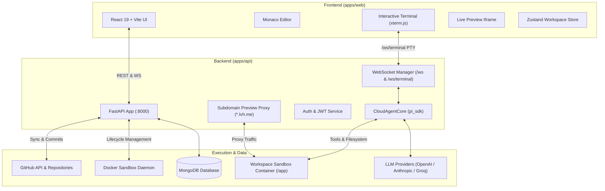

# Cloud Agent ☁️🤖

<div align="center">


**Next-Generation Autonomous AI Cloud IDE & Coding Agent Platform**

Full-stack autonomous software development workspace pairing an interactive Web IDE with isolated Docker sandboxes, real-time streaming AI agents, live browser previews, and bidirectional GitHub synchronization.

---

[](https://nodejs.org/)
[](https://pnpm.io/)
[](https://python.org/)
[](https://fastapi.tiangolo.com/)
[](https://react.dev/)
[](https://www.typescriptlang.org/)
[](https://www.docker.com/)
[](https://www.mongodb.com/)
[](https://turbo.build/)

</div>

---

## 🚀 Key Features

- 🧠 **Autonomous Agent Core**: Powered by `pi_sdk` with multi-step tool execution, bash shell execution, surgical file editing, project-wide research, and human-in-the-loop interactive clarification dialogs (`ask_user`).
- 🐳 **Isolated Docker Sandboxes**: Per-workspace containerized environment mounting dedicated project directories with configurable memory, CPU, and process limits.
- 🌐 **Instant Live Preview & Subdomain Proxy**: Automatic container port allocation with a built-in reverse proxy routing `<workspace-id>.lvh.me:8000` directly to running dev servers (Vite, Next.js, Node, etc.).
- 💻 **Full-Featured Web IDE**:
  - Interactive **Monaco Code Editor** with syntax highlighting and file-tree exploration.
  - Read-only locking while the agent is running to prevent editing conflicts.
  - Interactive real-time **PTY Terminal** connected over WebSockets.
  - **Context Window Indicator** with circular gauge visualizing filled tokens, room to compact, and threshold limits.
- 🔄 **Bidirectional GitHub Integration**: OAuth connection, automatic remote repository creation, platform bot fallback, and real-time git commit & push sync.
- ⚡ **Context Management & Auto-Compaction**: Automatic token summarization preserving recent message history when context limits are reached.
- 📊 **Comprehensive Admin Console**:
  - **AI Model Catalog**: Configure LLM providers (OpenAI, Anthropic, Groq, custom), set default models, and customize token pricing.
  - **Usage & Cost Analytics**: Real-time tracking of prompt tokens, completion tokens, cached tokens, and estimated USD spend.
  - **Plan Budgets & Soft Caps**: Configure monthly spending limits per tier with proactive threshold warnings.
  - **Sandbox Quotas**: Dynamically tune container memory limits, CPU shares, and PIDs limits.

---

## 🏗️ Architecture



---

## 📁 Repository Structure

```
cloud-agent/
├── apps/
│   ├── api/                  # FastAPI Python backend service
│   │   ├── src/
│   │   │   ├── ai_core/      # CloudAgentCore, tools (ask_user, git, read), sandboxes
│   │   │   ├── controller/   # Route controllers (admin, chat, workspace, sessions)
│   │   │   ├── models/       # Pydantic & Mongo models
│   │   │   ├── repository/   # Data access repositories (usage, models, users)
│   │   │   ├── services/     # Git sync, commit generator, files service
│   │   │   └── ws/           # WebSocket endpoints (/ws, /ws/terminal)
│   │   └── pyproject.toml    # Python package & dependency definition
│   │
│   └── web/                  # React 19 + Vite + Tailwind CSS web workspace
│       ├── src/
│       │   ├── components/   # Workspace UI, Monaco editor, Chat, Admin console
│       │   ├── lib/          # WebSocket client, API fetchers, event parsers
│       │   ├── stores/       # Zustand state stores (workspace, sessions)
│       │   └── types/        # TypeScript interfaces & WS event shapes
│       └── vite.config.ts    # Vite bundler configuration
│
├── packages/
│   └── shared/               # Shared TypeScript schemas, contracts & Zod validators
│
├── sandbox/
│   └── mounts/               # Host mount root for workspace project directories
│
├── turbo.json                # Turborepo pipeline configuration
├── pnpm-workspace.yaml       # Monorepo workspace configuration
└── package.json              # Root package scripts
```

---

## 🛠️ Tech Stack

| Domain | Technology |
|---|---|
| **Monorepo Engine** | [Turborepo](https://turbo.build/) + [pnpm](https://pnpm.io/) Workspaces |
| **Frontend Framework** | [React 19](https://react.dev/), [Vite](https://vite.dev/), [TypeScript](https://www.typescriptlang.org/) |
| **Styling & Components**| [Tailwind CSS](https://tailwindcss.com/), [shadcn/ui](https://ui.shadcn.com/), [Radix Primitives](https://www.radix-ui.com/), [Lucide](https://lucide.dev/) |
| **Editor & Terminal**   | [Monaco Editor](https://microsoft.github.io/monaco-editor/), [@xterm/xterm](https://xtermjs.org/) |
| **State Management**    | [Zustand](https://github.com/pmndrs/zustand) |
| **Backend Framework**   | [FastAPI](https://fastapi.tiangolo.com/), [Starlette](https://www.starlette.io/), [Uvicorn](https://www.uvicorn.org/) |
| **Agent Framework**     | [`pi_sdk`](https://github.com/Abhishekkkk-15/pi-sdk) |
| **Sandboxing**          | [Docker Engine](https://www.docker.com/), Docker SDK for Python |
| **Database**            | [MongoDB](https://www.mongodb.com/) (via `motor` async driver) |
| **Auth & Integrations** | Google OAuth 2.0, GitHub OAuth & REST API, JWT |

---

## 🚦 Getting Started

### Prerequisites

Ensure you have the following installed on your machine:
- **Node.js**: `20.x` or higher
- **pnpm**: `9.x` or higher (`npm install -g pnpm`)
- **Python**: `3.11` or `3.12`
- **uv** (recommended) or `pip` for Python packages
- **Docker Desktop** (or Docker Engine with daemon running)
- **MongoDB**: Local MongoDB instance (`mongodb://127.0.0.1:27017`) or MongoDB Atlas

---

### Installation

1. **Clone the repository**:
   ```bash
   git clone https://github.com/Abhishekkkk-15/cloud-agent.git
   cd cloud-agent
   ```

2. **Install frontend & shared dependencies**:
   ```bash
   pnpm install
   ```

3. **Set up the backend virtual environment**:
   ```bash
   cd apps/api
   uv venv  # or python -m venv .venv
   
   # On Windows:
   .venv\Scripts\activate
   # On Linux/macOS:
   source .venv/bin/activate

   uv pip install -e .  # or pip install -e .
   cd ../..
   ```

---

### Configuration

Create a `.env` file in `apps/api/`:

```bash
cp apps/api/.env.example apps/api/.env
```

Fill in your configuration details:

```env
# JWT & Authentication
JWT_SECRET=your-secure-random-secret
GOOGLE_CLIENT_ID=your-google-client-id
GOOGLE_CLIENT_SECRET=your-google-client-secret

# GitHub OAuth & Integration
GITHUB_CLIENT_ID=your-github-client-id
GITHUB_CLIENT_SECRET=your-github-client-secret
GITHUB_OAUTH_CALLBACK_URL=http://127.0.0.1:8000/integrations/github/callback
GITHUB_TOKEN_ENCRYPTION_KEY=your-32-char-encryption-key

# Database
DATABASE_URI=mongodb://127.0.0.1:27017
DATABASE_NAME=cloud-agent

# LLM Provider API Keys
OPENAI_API_KEY=sk-...
ANTHROPIC_API_KEY=sk-ant-...
GROQ_API_KEY=gsk_...

# Default Agent Settings
PROVIDER=openai
MODEL=gpt-4o
COMPACTION_ENABLED=true
COMPACT_AT_TOKENS=20000

# Docker Sandbox Mounts
WORKSPACE_BASE=D:\python\cloud-agent\sandbox\mounts\workspace
SANDBOX_MOUNT=/mnt/d/python/cloud-agent/sandbox/mounts/workspace
```

---

### Running the Application

1. **Start MongoDB and Docker Desktop**:
   Ensure Docker is active and MongoDB is running on port `27017`.

2. **Start all services**:
   ```bash
   # From root:
   pnpm dev
   ```

   Or start backend and frontend individually:
   ```bash
   # Terminal 1 - Backend API:
   cd apps/api
   .venv\Scripts\activate
   uvicorn main:app --reload --port 8000

   # Terminal 2 - Frontend Web IDE:
   pnpm --filter @cloud-agent/web dev
   ```

3. **Access the application**:
   - Web IDE: [http://localhost:5173](http://localhost:5173)
   - API Docs & Swagger: [http://127.0.0.1:8000/docs](http://127.0.0.1:8000/docs)
   - Admin Console: [http://localhost:5173/admin](http://localhost:5173/admin)

---

## 📜 Monorepo Scripts

| Command | Description |
|---|---|
| `pnpm dev` | Start development servers for all apps |
| `pnpm build` | Build all workspace apps & packages |
| `pnpm typecheck` | Run TypeScript type checks across all packages |
| `pnpm lint` | Lint all packages |
| `pnpm --filter @cloud-agent/web build` | Build production bundle for the web client |
| `pnpm --filter @cloud-agent/shared build` | Build shared contracts and type definitions |

---

## 🔒 Security & Sandboxing

- Each workspace container runs with dedicated network isolation and non-root sandbox execution permissions.
- Personal GitHub tokens and third-party credentials are encrypted at rest using AES-GCM (`GITHUB_TOKEN_ENCRYPTION_KEY`).
- File editing actions are isolated to the workspace source path, preventing host traversal attacks.
- Plan-based spending limits and automated soft-cap warnings protect against runaway API token expenditure.

---

## 🤝 Contributing

Contributions, issues, and feature requests are welcome!

1. Fork the repository
2. Create your feature branch (`git checkout -b feature/amazing-feature`)
3. Commit your changes (`git commit -m 'feat: add some amazing feature'`)
4. Push to the branch (`git push origin feature/amazing-feature`)
5. Open a Pull Request

---

## 📄 License

This project is licensed under the [MIT License](LICENSE).
